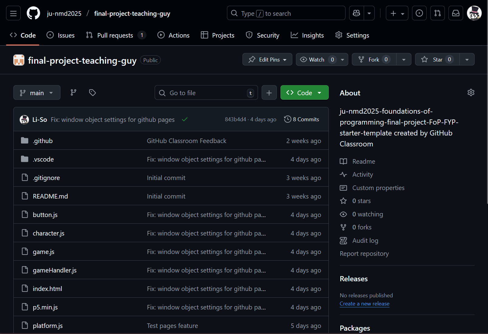
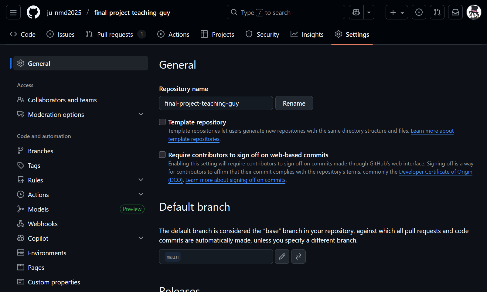
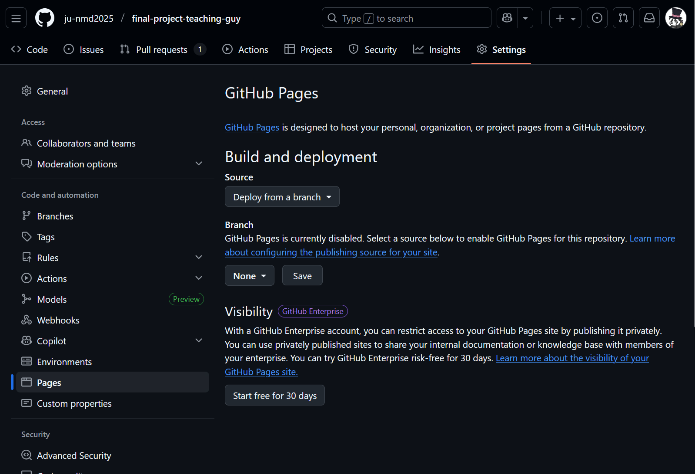
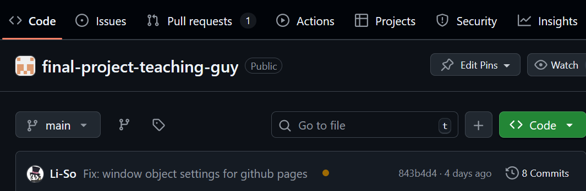
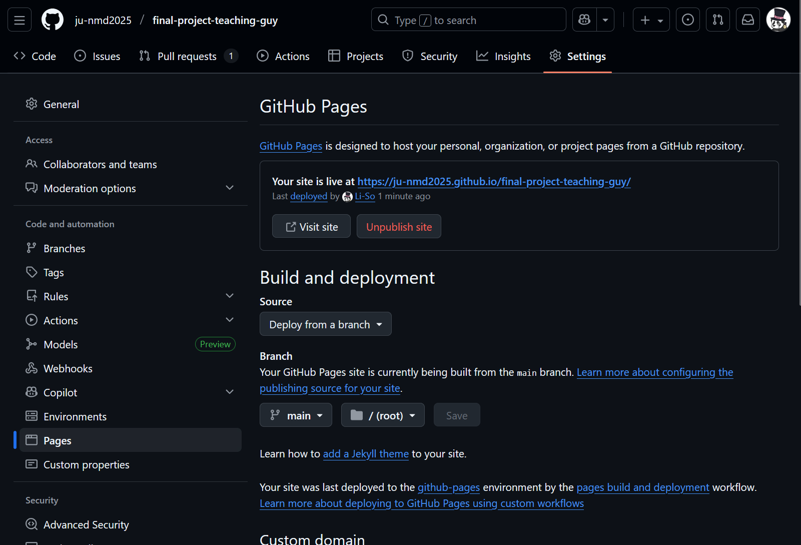

When you've finished with your p5js project and when all working code is merged into main, you will need to host your project on Github Pages. To do this, there are a few adjustments we need to make in order for p5js to properly work.

## 1.1 Crossing T's, dotting I's

First, make sure you download this file: [p5.min.js](js/p5.min.js){:download="p5.min.js"}. This file replaces the use of our extension when rendering our p5js games. There is no need to understand nor change anything in the file. Make sure to put this file in your project.

Make sure that your `index.html` file contains the following lines:

```html
<!DOCTYPE html>
<html lang="en">
	<head>
		<meta charset="UTF-8" />
		<meta name="viewport" content="width=device-width, initial-scale=1.0" />
		<title>Document</title>
		<link rel="stylesheet" href="style.css"" />
	</head>
	<body></body>
	<script type="module" src="game.js"></script>
	<script src="p5.min.js"></script>
</html>
```

Note specifically the lines with `<script>`. That is where we will load both our game.js file (from which we run the game using the p5js `draw()` function) and the p5 library (via the `p5.min.js` file). Note that the script type for `game.js` needs to have `type="module"` or it will not work.


Once you have checked that both the `p5.min.js` and `index.html` files need to be the same as provided here or there is a risk it will not work. You may need to adapt the paths if you use folders inside of your project, but if `game.js`, `p5.min.js` and `index.html` are outside of all folders, then it should work.

Do double check imports so that they all include `.js`, e.g. `import { Button } from "./button.js"`. In addition, even if you include e.g. `export default class SomeClass`, be sure to include `export { SomeClass }` at the bottom of the file (as well as anything else being exported). This becomes required as we are actually forcing p5js to act in a way it is not supposed to, so it is an approach we will have to live with.

## 1.2 Adding the necessary lines

Assuming we now have all the files in place, there are four lines that need to be added to the end of our `main.js` file:

```js
// All your other code is above!
window.setup = setup;

window.draw = draw;

window.addEventListener("click", function (event) {
    mousePressed();
});

window.addEventListener("keydown", function (event) {
    keyPressed();
});

```

Explaining exactly what it does is a little beyond the scope of this course, but the essence of it is that it allows the p5js library to use your code and show it on the website. You will need to add these lines for the game to render, react to clicks or keypresses.

!!! Note
	Assuming you are not using the standard p5js functions mousePressed and keyPressed, you will need to call what you use from the `window.addEventListener` functions.

## 2. Github Pages and you

!!! Note
	If any part of the following is not visible to you, such as not seeing a Pages part of the Github settings, contact me immediately.

Navigate to your repository on Github Pages and look for `Settings` towards the upper right corner:



Once there, find your way to `Pages`.


Next, make sure it says `Deploy from a branch` under `Source`. Under branch, click on `None` and select `main`. Don't change the directory folder to the right of the branch. Now click `save`.


Going back to our repository, you should now see a small yellow dot above your code:


If you refresh it periodically, it should eventually turn into a green checkmark. Once it does, go back to where we adjusted pages:



Click `Visit site` and you should see your game running in the browser!

All that remains is to present the game to Linus.