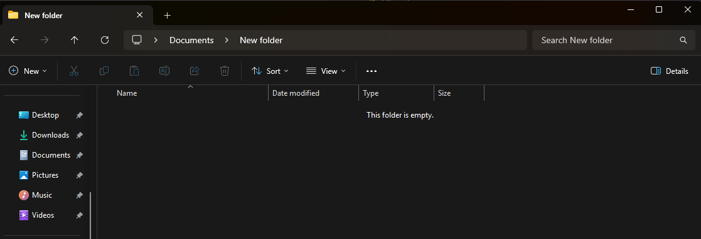
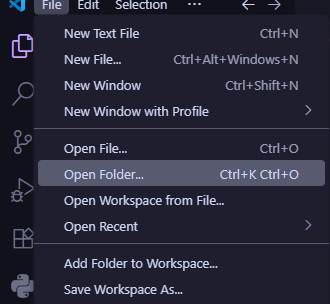
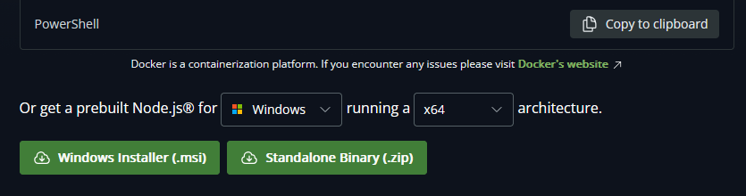
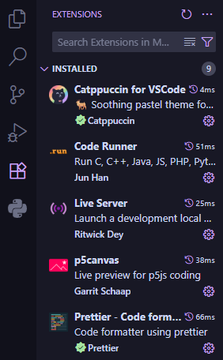
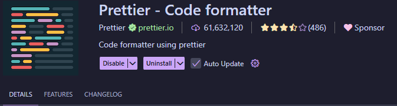
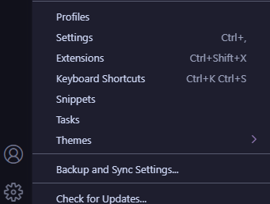
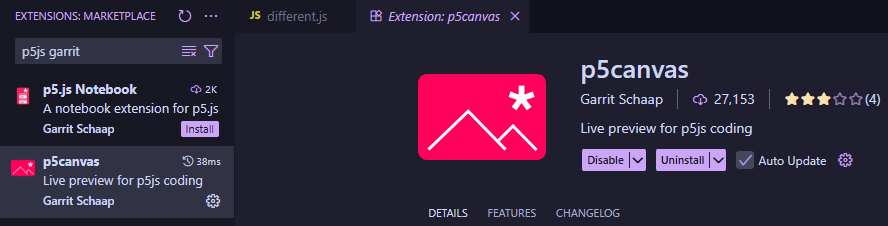
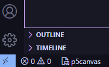
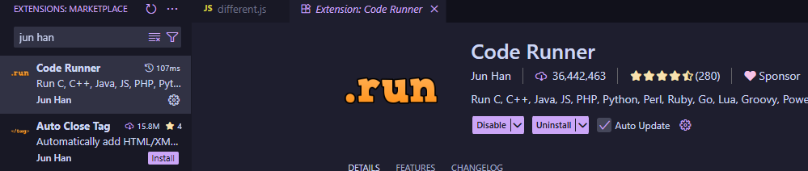
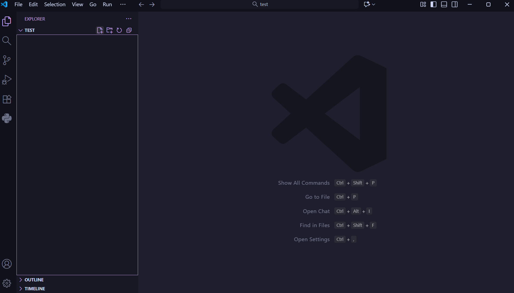

## 1.1 Mini Chapter: Systems Architecture (optional chapter)

You don't have to read this chapter, though if you run into issues installing software, this may be a good place to look.

In most of the installation guides, I will refer to _x64, ARM64_ and possibly some other architectures. The short version is, if you download software made for a different one than your system, it may not work. For many of you, this will probably not be an issue, but in case things don't work, this may be worth checking.

You can check your system in the following ways:

-   Windows
    -   Alternative 1: The visual way
        -   Go to settings, then the _About_ section.
        -   Under _device specifications_ you should see device type, which will say what you're using.
    -   Alternative 2: The cool way
        -   Open up Windows Powershell and run `Get-ComputerInfo | findstr "CsSystemType"`
            -   Alternatively, you can use `systeminfo | findstr /C:"System Type`
        -   This should print the systemtype you have.
-   Mac
    -   If you run `uname -m` it should print the system type you use e.g: _arm64_
-   Linux
    -   If you run `uname -m` it should print the system type you use e.g: _x86_64_.

x64? ARM? Legs?
[What does he mean?](https://www.partitionwizard.com/partitionmanager/arm64-vs-x64.html)

---

## 1.2 Tools

Listed below are some of the tools we will use throughout the course and how to install them. They include the chosen code editor VSCode, Git, NodeJS and some extensions we will need for VSCode. While there are other alternatives one might use, these were chosen due to popularity of use in the industry.

## 1.2.1 VSCode

This is the code editor you'll be using for this entire course (and often while doing web development in general). Keep in mind it is not a full _IDE (integrated development environment)_ so we'll need a few extra things to really get started.

You'll find the download link here for most platforms: [Download VSCode](https://code.visualstudio.com/Download)

Choose one that is appropriate for your computer (the largest download buttons should also work):

-   Windows
    -   Most likely, you have _x64_, if you want the simplest version choose the _User Installer System_.
-   Linux
    -   This depends on your distro, but if you use Linux you probably know ;)
-   Mac
    -   Assuming the "big" download button doesn't work, it might depend on your CPU. Assuming it doesn't work, _try the Intel version_ (since I am under the impression most have Apple Silicon).

Once you've downloaded it and traversed through the guides, you need somewhere to put your code. Create a folder somewhere on your computer (e.g. inside of Documents) and name it something appropriate (**not** "New Folder"):



Enter it via VSCode (menu should be in the top left):



Now you have somewhere to put all your code and your projects. My suggestion for most assignments is to divide assignments into either separate files or entirely separate folders. This will make it easier for you to find them later.

## 1.2.2 Git

This version control software is integral later in the course (and for any future programming you do), so ensure the install works from the very beginning.

You'll find the download link here for most platforms: [Download Git](https://git-scm.com/downloads)

-   Windows
    -   Download the latest _x64_ version featured at the top (or via the standalone installer), unless you happen to have ARM64.
    -   Test that it works via either CMD or Windows Powershell and write: `git --version`. Hopefully it should print the current git version, which means you've succeeded.
-   Linux
    -   Git should already be installed
    -   But if it isn't, it will depend on your distro.
    -   Test that it works via your chosen terminal and write: `git --version`. Hopefully it should print the current git version, which means you've succeeded.
-   Mac
    -   Alternative 1: Apple Store
        -   Apple should ship a version of Git on their store. Download it and it should work.
    -   Alternative 2: Terminal
        -   Apple ships git via XCode, their tools for development
        -   On your Mac, search for _Terminal_.
        -   Inside of the terminal, paste this: `xcode-select --install` and click enter.
    -   Test that it works via the Terminal app on Mac and write: `git --version`. Hopefully it should print the current git version, which means you've succeeded.

## 1.2.3 NodeJS

NodeJS is a JavaScript runtime environment that will let us run JavaScript inside of our VSCode setup. You'll also be using it later in web development courses.

You'll find the download link here for most platforms: [Download NodeJS](https://nodejs.org/en/download)

I suggest going for the prebuilt Node.js packages found a little further down the page, here:


-   Windows
    -   I suggest getting the prebuilt Node.js package with system architecture fitting your computer's specifications.
    -   Should be rather simple via a provided Windows Installer.
    -   Test that it works via either CMD or Windows Powershell and write: `node --version`. Hopefully it should print the current node version, which means you've succeeded.
-   Linux
    -   Should be available on your distro's package manager, if not there is a standalone binary file you could use.
    -   Test that it works via your chosen terminal and write: `node --version`. Hopefully it should print the current node version, which means you've succeeded.
-   Mac
    -   I suggest getting the prebuilt Node.js package with system architecture fitting your computer's specifications.
    -   Should be rather simple via a provided macOS Installer.
    -   Test that it works via your Terminal app on Mac and write: `node --version`. Hopefully it should print the current node version, which means you've succeeded.

Now that you have node, you can actually run any JavaScript files on your computer using the command `node <yourFile>` in your terminal. This is quite tedious though, and not something I immediately want you to think too much about, so we'll install an extension runner later to avoid it.

## 1.2.4 Github Desktop

Github Desktop is a software that will make interactions with Github easier for those who may not be well acquainted with using git and want an easier way to get started as compared to the command-line.

You'll find the link here for Windows & Mac: [Download Github Desktop](https://desktop.github.com/download/)

Once you've downloaded it, try opening it up to see if it works!

## 1.2.5 The nuclear option

Assuming nothing works for one reason or another, there are a few online JavaScript editors which will allow you to get started on tasks:

-   [p5js online editor](https://editor.p5js.org/)
    -   By removing the draw and setup functions (blank textbox), you can use it as a "normal" code editor.
    -   Allows you to save projects if you are signed up
    -   **DOES** work for p5js code.
-   [Programiz](https://www.programiz.com/javascript/online-compiler/)
    -   Simple enough and allows you to run standard JavaScript code
    -   Will **NOT** work for p5js code.
-   The Console
    -   In the absolute worst case scenario, code can be written in a separate environment and pasted in the console of any browser.
    -   Will **NOT** work for p5js code.
    -   If you are unfamiliar with it, I can showcase an example.
        -   This is truly the absolute worst case scenario and should not be considered an option.

While browser-based code editors like these are easy to get started in, they are seldom used in true development environments, which is why we'll avoid them for the most part.

---

## 1.3 Extensions

There are some extensions in VSCode we will require to make everything work. These are found under the extensions tab to the left in VSCode (assuming standard settings):



You simply search for extensions and install them! They may include anything including e.g. highlighters, themes (such as _Catppuccin_ in my case), framework support etc. I recommend installing ones with a certain amount of installs / stars though, as there may be suspicious code in some of them.

### 1.3.1 Prettier

Search up **prettier** on VSCode extensions and install.

Prettier is a code formatter we will use for a consistent code style. Once you've searched for it and installed it (should be first in the list, about 60.000.000 installs):



Now that it is installed, go to your settings (bottom right):


Search for _formatter_ in the settings search bar and change the default formatter to Prettier. Make sure to also enable _Format on Save_.

### 1.3.2 P5JS Extension

In order to write p5js code in our own editor, we'll be using an extension created by the previous teacher of the course, Garrit. Search up **p5js garrit** on VSCode extensions and install the one highlighted below:



Open / create any JavaScript file using VSCode. You should note a small button/icon close to the bottom left corner:



If you press it, a canvas should appear in a separate window. It will automatically run your code without the use of NodeJS or the next extension *runner* (see below). This is in large part due to p5js re-running code constantly, but this extension will be the default tool for your p5js assignments.

### 1.3.3 Runner

A small extension purely for our own quality of life. Search for **runner jun han** on VSCode extensions and install install what should be the top one:



Once installed, you should note a small "play" button near the top right corner of VSCode. Pressing the button while inside of a JavaScript file will use our previously installed NodeJS to execute the code in a nice and easy way. Wonderful for learning basic programming logic or just testing a code snippet without using the browser.

## 1.4 Task Types

Not all tasks in this worksheet will be problem solving tasks. Some will include examples where you merely type the code into your own editor to understand what is happening when the code runs. This is especially true for the beginning of the worksheet, as a strong fundamental understanding is required before tackling the more complex tasks. Don't skip these tasks! Writing code on your own and taking a moment to understand it will further your understanding far more than copying with no thought. I also strongly urge you to change minor details in these tasks to familiarize yourself with what might work and what might not.

---

## 1.5 Hello World!

Let's create a simple beginner script to print "Hello World" for us to see if the development environment works. Open up *VSCode* and choose a folder (directory) to work in. In this new folder, create a new file called `helloWorld.js` (you can make one via the _new file_ button to the left).



Write the following lines in your editor and run the code via the play button we have via the *runner* extension:

```js
console.log("Hello World!");
```

Assuming everything is installed correctly, a terminal should display the text _"Hello World!"_. Once you've made sure it works, try changing something in the line, save and run the program again. You'll most likely run into an error (which is good!). Fix the error, save, and re-run the program. Try this a few different times to see what errors you manage to get and try to decipher what they mean.

## 1.6 Testing Prettier

In the same file `helloWorld.js`, add the following lines (with spacing as is):

```js
console.log(1);
        console.log(2);
    console.log(3);
```

Notice how the spacing is different for each line? Technically the interpreter/compiler won't mind, but to programmers this is _extremely_ important for bug fixing and consistency. Assuming your Prettier extension works and has been set up properly, the file should automatically format when saved (_ctrl/command + s_ usually). Note that even if you have auto save enabled, Prettier requires a manual save to auto format.
