Git is an open-source distributed version control system created by Linus Torvalds (a Finnish person who also made Linux). Using git means you have full access to your codebase history, and all code changes are tracked, restorable and revertible. Git is frequently used in the programming industry, with some considering it a skill that is just as important as programming.

Github is a cloud-based hosting system that works **with** Git. Essentially, your codebase is stored elsewhere. Github is a very popular tool for sharing and collaborating on code, hosting everything from personal to professional projects. The workflow you learn from here is most likely what you will use in the industry (with the possibility for some variations).

This chapter will introduce what both Git and Github are in more detail, as well as some tutorials to get used to them.

!!! Note
	This chapter may become especially confusing as it is a brand new topic in the middle of learning JavaScript. The reason for this abrupt break is due to a group assignment. I **strongly** suggest reviewing the slides and using the [training website](https://learngitbranching.js.org/) to see the structure visualized. The optional chapters may be **very** helpful to read through, though not essential.
## 4.1 Special Background Information (optional chapter)
There may be some terminology you aren't familiar with in this chapter which isn't Git specific. I will try to introduce some of the most fundamental ones here, just to make sure everyone is on the same page.

- **Directory**
	- A file system structure that contains references to other files and directories (in essence, a folder on your computer). 
	- For instance, if you were looking at what is stored on your desktop, I would find that here (Windows): `C:\Users\sonlin\Desktop`
		- Those backslashes signify that the "folder" desktop, is actually inside another folder "sonlin", which is in another folder "Users". The C: is just what harddrive we're on, don't worry about it too much.
		- This looks different if you're on Mac or Linux, more like this: `~/sonlin/Desktop$`

- **Short version: Terminals & Shells**
	- TV example:
		- Imagine yourself sitting next to a TV with Netflix.
		- The screen you see, is roughly equivalent to the terminal.
		- The thing actually running Netflix in the TV is the Shell.

- **Terminal**
	- Originally, a terminal was a physical device used to send input and output from a computing device.
	- Today, we usually mean *terminal window or terminal emulator*.
	- A terminal window or terminal emulator is a text-only window that let's you interact with a *Command-Line Interface (CLI)*, which in turn allows you to interact with the "real brains", *the shell*.
	- Example terminal emulators:
		- Terminal (Mac)
		- Windows Terminal
		- Ghostty
		- Warp
- **Console**
	- Back in the day, it was the physical device you used to interact with the computing device, e.g. a keyboard.
	- A special type of terminal, one you may encounter when there is no desktop.
		- Imagine it as a "primary terminal" for that specific computer. 
	- Term can also be used to designate terminal emulators.
	- Difference is not massive to terminals.
- **Shell**
	- A program that processes commands and returns output. 
	- This is the program that tries to read your commands and pass them on to the inner sanctum of the computer, *the kernel* which in turn does your bidding.
	- Example shells:
		- Bash
		- sh (older version of bash)
		- Zsh
		- Ksh
		- Fsh
- **Command-Line**
	- The place you type your commands into
	- Sometimes called the Command Prompt
	- Has different symbols, such as `>` or `$`
	- Looks like e.g:
		- `C:\Users\sonlin\Desktop>`
		- `sonlin@JTH_Computer:~$`


### 4.1.1 Moving around in a terminal (optional chapter)
In this subchapter, we will have a brief look at how to move around in a terminal. In principle, moving around is quite simple: We only need 2 commands to go somewhere and to see where we go.

When you open a terminal, it is more than likely you start here: 


The small `~` sign before `$` essentially shows we are in our home folder. It is normally the folder that contains your desktop folder, your documents folder, etc:


That's where we will try our first command. Using `ls` (short for *list*) and pressing enter to execute the command, you can see all of the folders or files in a given directory. Try it out!

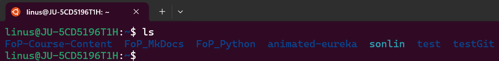
If you also happen to have *hidden files or directories*, you can use `ls -a` to reveal them.

Now that we know how to see where we are and what there is, we'll try to move around. To do this, you can use `cd <directory-name>` (short for *change directory*). Since I have different folders in my example, you can use `cd` into some other folder:


Note how the terminal now looks different, and `~` has changed into `~/FoP-Course-Content$`. This is a useful indicator of where we have moved. You can now use `ls` again and the contents of where you are should be listed.

Depending on your VSCode installation (which *should* include this feature), you can also write `code .` in the folder (directory) you want VSCode to open up in. This can save you some time instead of having to look for the project in normal folders.
## 4.2 Git
I will try to show each part using both a graphical user interface via *Github Desktop* and via *a terminal*. The terminal gives full access to all git functionality, but may feel intimidating to start with. I encourage you to try though, as understanding what happens in the terminal will give a better understanding of what actually happens in the background. 

!!! Note
	Note that my chosen project or directory names throughout this tutorial with git and Github Desktop need to be adapted depending on your own project or directory names.

### 4.2.1 Init
#### Git (Terminal)
In order to get started with git, you will need to create a *repository*. In essence, you are simply telling git that everything in a certain folder (or *directory* if you will), should be saved as part of a project.

Let's create a fresh new repository.
#### Terminal
```bash
linus@JU-5CD5196T1H:~/testGit$ git init
```
Above, I created a new folder *testGit* in my `home` directory (file explorer or terminal) and ran the command *git init*. We now have a repository to work from!

---

#### Github Desktop


If you instead opt to actively use Github Desktop, create a [Github Account](https://github.com/signup?source=form-home-signup&user_email=). Sign in and you should see the following:


Using Github desktop, we instead press `Create a new repository on our local drive` and we should see this window:

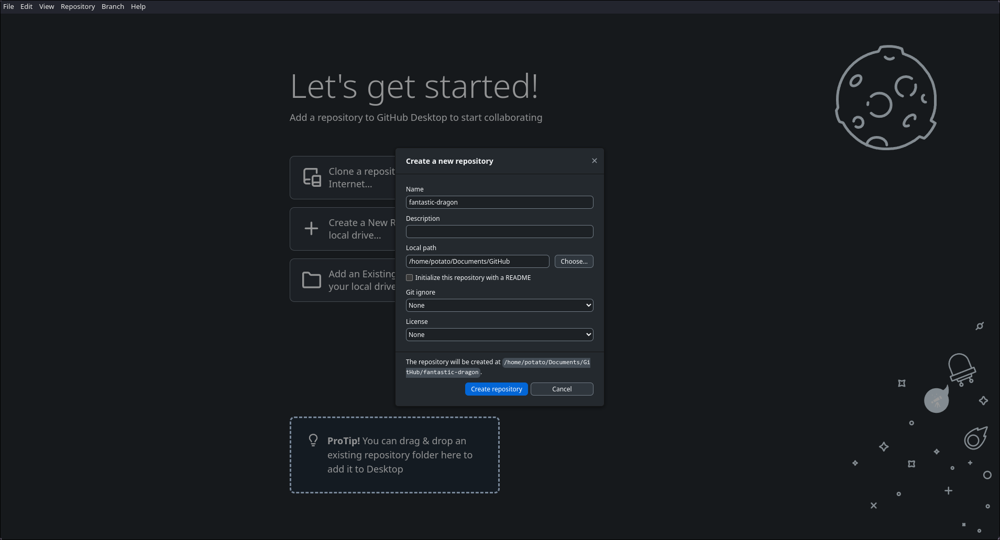

From here you may choose:

- Repository name (your project name)
- Some description (for others to read and understand the project)
- The path (where you want to store it)
- gitignore (see Github subchapter)
- license (see Github subchapter)

!!! Note
	Peeking ahead into the Github subchapter, you may notice several parts are very similar to creating a repository on their website.

For this example using Github Desktop, I'll use the repository name `fantastic-dragon`. We should now automatically proceed to the following screen:

This is where Github Desktop shows all your options and tools for working with your repository using git. Let's walk through it:

- **In the top left**, going from left to right you can see(*note, beneath file, edit, etc*):
	- The repository name - fantastic dragon.
	- The branch you are on - main (more on branches below).
	- **Publish repository** - Will upload your project to Github. More on that later.
- *In the center*
	- Currently it displays no local changes, as we've yet to do much in the repository.
	- Open your repository in your external editor - A fast way to open up VSCode and get to work.
	- View the files of your repository in your File Manager - A fast way to open the repository in your files.


### 4.2.2 Commit

#### Git (Terminal)

As a next step for doing something in the project, we'll create an easy text file in the folder. Let's make *helloWorld.txt* and write:

```txt
Hi! My name is...
```

!!! Note
	Do not fill in your name just yet! We'll do that later.

If you now use the command `git status` in the terminal, you should notice it mentions untracked files. That is because we have yet to tell git that this is a file we want to track changes in. 

To track it, we use `git add helloWorld.txt`. Using `git status` now will display:`Changes to be committed:` and `helloWorld.txt` should be listed beneath it. So what did we actually do? 

Git has 3 separate stages. Changes can be `untracked, staged or committed.` New changes must be added to **the staging area** if you later want to commit them (sometimes you don't want to commit all you've done). 

For now, we've added our new file to the staging area, which is equivalent to telling git we want to commit it. 

If it is our very first commit, we first have to identify ourselves to git so that it knows who to attribute the commit to. We do this via the following:
```bash
git config --global user.name "John Doe"
git config --global user.email johndoe@example.com
```

Now we are ready to commit our changes. We'll use the command `git commit -m "Add: helloWorld.js file"`. Technically just using `git commit` would achieve the same thing, though you would have to add a commit message afterwards instead of in the same command. 

!!! Note
	If you accidentally miss entering the `-m` part, odds are you find yourself in a terminal program called `nano`. You can exit via `ctrl + X` (Windows/Linux) or `command + X`  (Mac)


If you now use `git log` to show the current repository's version history, you can now view your previous commit.

!!! Note
	Sometimes you will see `git add .` or `git add *`. The first means to add all changes in your current folder (for large projects, this would not add everything). The second would add **ALL** changes you've made inside the repository. It is a little faster.

---

#### Github Desktop

Let's do the equivalent in Github Desktop. We'll open the repository (either on our own, via the `open external editor` button) and create a new textfile. We'll write the same text (`Hello! My name is...`) and save. 

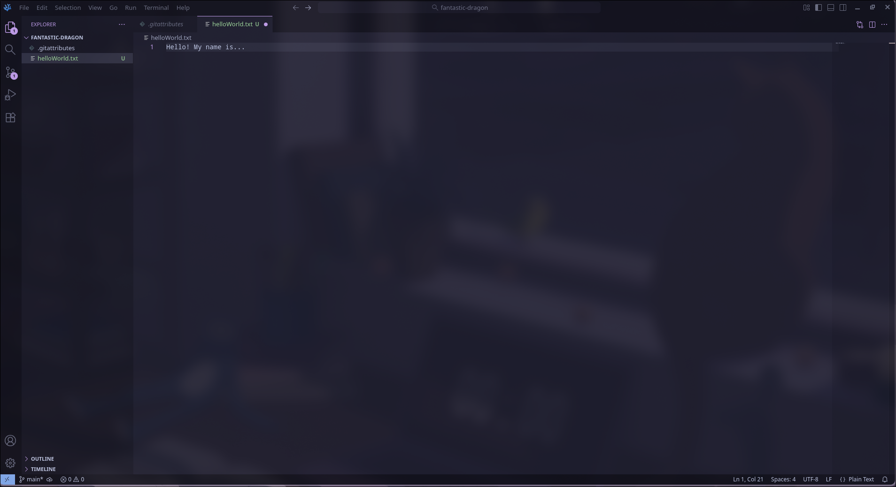

Returning to Github Desktop, we can see it displays the changes we have made since last time. To commit, we simply fill a commit message in the bottom right, a longer description if required, and press `commit to main`. The changes are now committed!


### 4.2.3 Branch

#### Git (Terminal)

Let's assume you have several features you want to create. In case things go a little sideways, it might be good to be working on a *branch*. Essentially, this is an offshoot from your **main** branch. Changes you make here will not affect the **main** branch, nor will changes there affect this one. 

Let's make a branch: `git branch add-name`. Note that we're not actually *on* that branch right now, we've just created it. To switch branch, you can use the command `git checkout add-name`. To be sure you've just switched, you can use `git branch --list` to see all the branches (the one you're on should have an asterisk next to it \*).

Now that you're certain you've switched branches, do you notice how nothing is different? Because we were on the **main** (or master) branch, **add-name** has all the same changes it did. Let's change that.

Add your name to the text file from earlier:
```
Hi! My name is Linus!
```

Use `git add helloWorld.txt` to add all your changes and use `git commit -m "Add: Added my name to helloWorld.txt"`.

---

#### Github Desktop

Let's try this in Github Desktop. If you click the button currently displaying **main** next to our repository name, you'll see a new button `New branch`. Click it!


The following options should show. Fill in the **add-name** branch name and create the branch. This branch is based on the **main** branch just like when only using git. We can easily switch branch by clicking the appropriate branch under the same menu we found `New branch`. Github Desktop will display which is our current branch.


Open the repository in VSCode and add your name to the text file from earlier:
```
Hi! My name is Linus!
```

Return to Github Desktop and commit!


### 4.2.4 Merge

#### Git (Terminal)

Now we have some changes on the branch **add-name**, changes we want to our **main** branch. To do this we can use `git merge` via the following:

- Make sure you are on the **main** branch
	- You can check branch you are on via `git branch`, which will display the existing local branches as well as your current branch via an asterisk `*`.
	- You can switch branch using `git checkout <branch-name>`
- Once on the **main** branch, write `git merge add-name`: This will merge **add-name** into your **main** branch.

Perfect! Now we have the name we added from our **add-name** branch in our **main** branch. Double check the textfile to make sure this is true.


---

#### Github Desktop

To achieve the equivalent in Github Desktop, click the current branch to see the menu observed earlier. Note that at the very bottom of the branch menu, there is a button `Choose a branch to merge into main` (assumes you are currently on main). Once clicked and confirmed, the merge is complete!

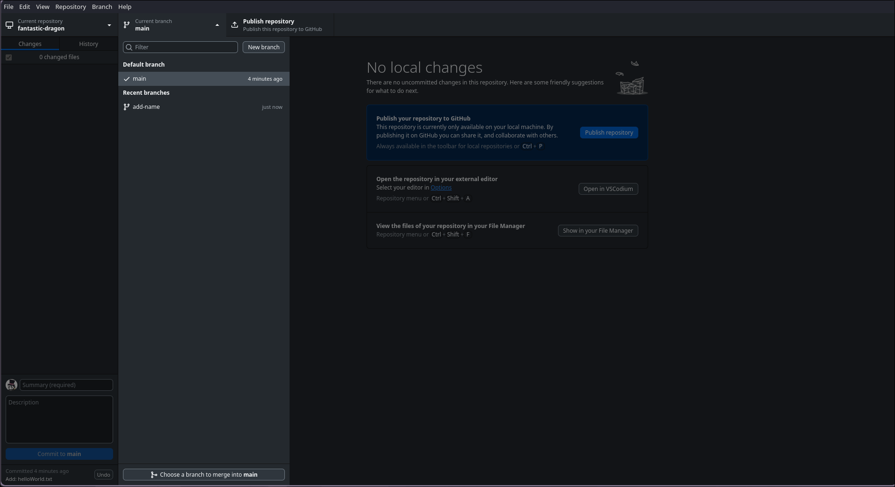

You will also receive a small message noting that the merge was successful.


### 4.2.5 Rebase

#### Git (Terminal)

An alternative to merging for changes in a different branch, is to rebase them. While merging shows two different histories merging together, rebasing is closer to putting the commits of another branch, on top of your branch of choice. It can be a powerful tool if you don't enjoy the messiness of many merges, though I recommend using merge in general for this course if you are uncomfortable with rebasing.

!!! Note
	This example uses the branch **main** and **add-name**. Adapt it to your own branch names.

Here's an example you can do to try it out:

1. Commit something on the **main** branch, e.g. the text example we did in the chapters before. To stay safe from **conflicts** which we will look at in the next subchapter, you can commit a file with content of your choosing.
2. Switch branch to **add-name** and make a different file with content of your choosing.
3. Now go back to the **main** branch and write:
   `git rebase add-name`. What happens?
	- In essence, we've now rebased our **main** branch on top of the **add-name** branch
	- We have all the features from add-name
	- You can get more specific and use `git rebase add-name main` but there is no difference compared to if you're on **main** using `git rebase add-name`. 

---

#### Github Desktop

Perform similar actions as described in the git guide above, but using Github Desktop to achieve them. To rebase (step three of the git guide above) when using Github Desktop, you'll have to go under one of the top-most options (same row as `file` and `edit`) and look for `branch`. Click it, and choose the `Rebase current branch option`. If you are on the **main** branch, the next section ought to look like this:


Despite choosing to rebase, there are other options shown, including merge, squash & merge and rebase. While merge and rebase are both familiar, squash and merge may not be. In short, it is a method of *squashing* multiple commits into one and merging that commit. For now, choose rebase and click the button to perform the rebase.


The rebase should now be complete and there should be a success message similar to the one we received when merging!

### 4.2.6 Some Tips & Tricks (Git specific)
Git has a lot of different commands that are helpful in a variety of situations. I am not going to list them all here, nor their full use, but here are some useful things you may find a use for which you can search for later. 

- `git commit --amend`
	- Allows you to add things to your last commit in case you forgot files or want to change the commit message
- `git commit -a`
	- Stage AND commit all of your changes
	- Same as running `git add .` and then `git commit`
	- **ONLY APPLIES TO TRACKED FILES.**
	- Don't forget to add a commit message!
- `git stash`
	- Allows you to save your *uncommitted* changes if you want to go to a separate branch to do some separate work
	- You can get them back via `git stash pop`
	- Or drop them via git stash drop
- `git diff`
	- Shows all the changes you've made (not staged)
	- Alternatively `git diff --staged` shows what is staged but not committed
- `git log`
	- Shows all the previous commits.
- `git checkout -b <branch-name>` 
	- Effectively like `git branch <branch-name>` and `git checkout <branch-name>` in one command
- `git clean`
	- Remove untracked files from your working directory
- `git reset`
	- Unstage changes or revert your working directory to the previous commit

---

## 4.3 Github
We will now begin sharing our work by reviewing the methods of storing our git repository in the cloud via Github. Sending code back and forth via emails, text messages or through a phone call are all quite inefficient. Sharing our code by means of Github though allows us to collaborate wherever we are without major issues. The majority of this part will be the same for git and Github.

### 4.3.1 Making a repository
This is the dashboard view of Github, which is most likely the first thing you will encounter once you log in.


Clicking the hamburger menu icon (the three lines in the top left) will allow you to navigate most of the website. For now though, try to find the `+` button towards the top right of the website. Clicking it should reveal *New repository*. Click it!

You should now find yourself here:


Let's walk through all the options visible on this page:

- **Repository name**
	- Choose a name for your repository, using `-` as spaces (e.g. test-repository).
	- If you don't care much about what to name it (if you're experimenting) then you can use their standard name marked in green under the text-bar (suggested by Github).
- **Description**
	- Choose some form of description for your project. 
	- Keep it clear, keep it concise.
- **Visibility**
	- Private or public, if public anyone can view it
	- If you're doing it outside of a task, you might want to put it on private
		- But if it **is** for a task, make sure it is public (otherwise I cannot grade)
- **Template**
	- Sometimes you need the same starting files as another project, and in those cases a template is good.
	- You won't need to think about it during this course.
- **README**
	- Effectively a longer description.
	- Usually contains what the project is, how to use it etc.
	- Documentation for your project
- **.gitignore**
	- Things for git to ignore in your project
	- Usually things like:
		- Your own system files
		- Your own virtual environments
		- Packages used in a project (you leave a list of things to install and let the user install them)
- **License**
	- How are others allowed to use your code?
	- There are a bunch, you can google each of them on your own

For now, we'll just fill in a name and make it private. We will now find ourselves here:


Let's similarly walk through everything on this page.

- **Codespaces**
	- This option will start a cloud development environment (an alternative to coding in VSCode), though this is not very common in most professional settings.
- **Invite collaborators** 
	- If you want to add others to the project immediately, you can do so via the *invite collaborators* button.
	- Not necessary in this case.
- **Quick setup**
	- As it states, more so if you've done this before. Provided you have **Github Desktop** you can click *Set up in Desktop* to quickly get the repository on your local machine.
- **New repository on command line**
	- If you don't already have a local repository on your computer that you want to push, you can copy the block of code and paste it in your terminal.
	- Now you have the repository locally!
- **Push an existing repository from the command line**
	- If you already had a local repository, you can copy the block of code and run it in the same repository as your local one.
	- Keep in mind, you may face **conflicts** if you added a README or something similar, as the content will be different.

---

#### Git (Terminal)

For now, we will use **New repository on command line**. Copy the code block and open up a terminal. If you have a folder for storing programming projects, go to that one using the commands we learned before (`ls`,`cd`). Create a separate folder for your project (named the same) and paste the code block. You should now have the project locally (there should be a file called **README** if you want to make sure).

---

#### Github Desktop


To achieve the same result using Github Desktop, click the `Current Repository` button far to the top left of Github Desktop. Click the `Add` button. 

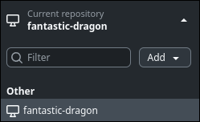

You can either log in via Github.com and choose your repository from there, or provide the URL (the link / web address) to the repository. Choose where you want the repository to be stored in `Local path`.


The repository should now be on your local machine!

### 4.3.2 Push

#### Git (Terminal)

Now that we have the project locally, let's try to make some changes to it. Open up the git repository in VSCode (if you're in a terminal, use `code .`). For instance, we can add a JavaScript file `helloWorld.js` and write `console.log("Hello World!")`. Save the file, stage it (`git add .`) and commit it `git commit -m "Add: helloWorld.js"` (note the message is not the best, it is merely an example).

Now that we have made a change in our *local* repository, you need to **push** that change to the **online** (remote) repository (since it doesn't have your commits). We can achieve that by by using `git push`. If you now check github under the **commits** button (under the *green code button*), you should see the commits:

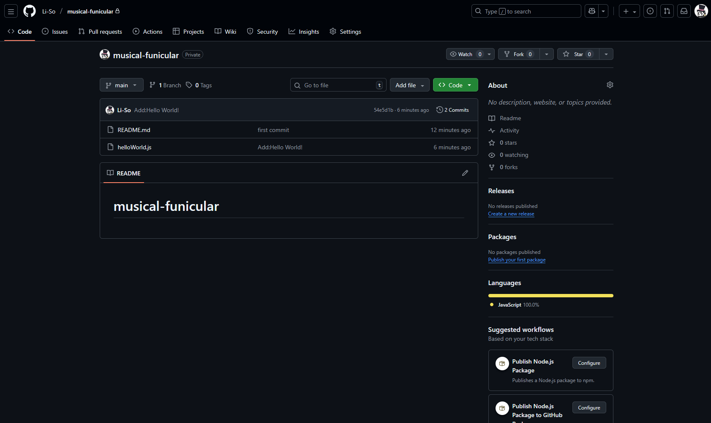

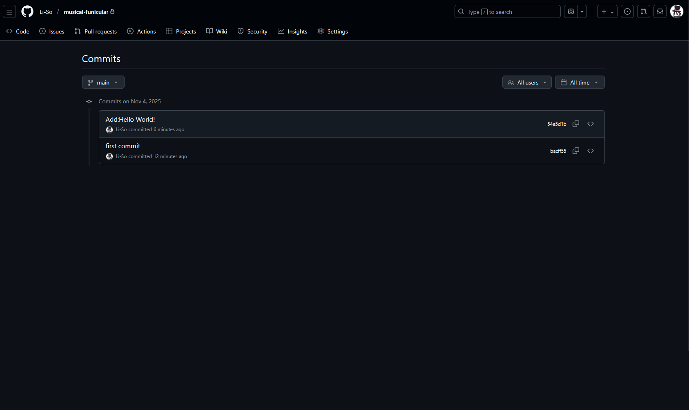

To go back to the repository overview, simply click the `< > Code` button to the top left.

!!! Note
	If you make a new branch and push, you will most likely have to perform the following command: `git push -u origin <branch-name>`. This simply informs git *where* on the remote machine you are trying to push the changes (since the remote machine might not have that branch made yet).


---

#### Github Desktop

When using Github Desktop, we similarly need to make some change. Perform the same change as the Git example above, creating a new JavaScript file `helloWorld.js` and write `console.log("Hello World!")`. Returning to the Github Desktop application, you may observe that the button next to `Current Branch` has changed to `Push origin`. Click it, and Github Desktop will push your changes to the remote repository.


### 4.3.3 Pull

#### Git (Terminal)

This will be more important as you start collaborating, but we will simulate that something has happened on your repository (e.g. someone added a file). For your project locally to be up-to-date, you will need to **pull** those changes.

Go into Github and press the `Add file` button, selecting the option to `Create new file`. button (right next to the *green code button*). This should take you to an online editor:


In this example, the name and some content is already filled in. Now click the **green commit button in the right corner**. 

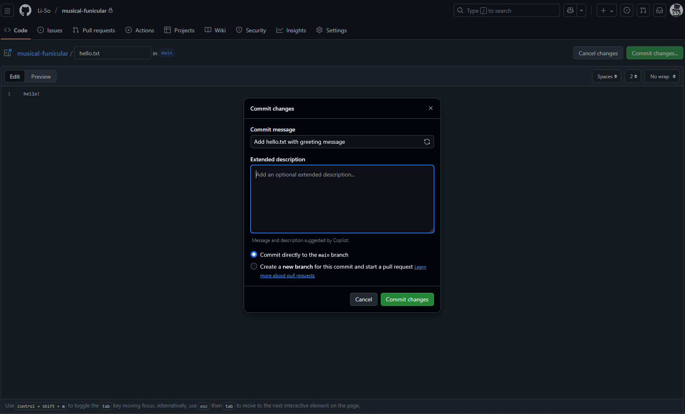
Fill in some information (as you would with any regular commit) and click **commit changes** (yes, commit directly to the main branch). Once done, go back to the main page (click `< > code` to return). You should see that there has been another commit and our `hello.txt` file is present.


Finally, go back to your repository. Run the command `git pull` and you should have the changes locally. You may encounter warning text the first time you run `git pull` as git requires some guidance on how you want to reconcile divergent branches. For the purposes of this course, if you encounter the error you can run this line: `git config pull.rebase false`. Now git pull will integrate the changes via a merge. 

!!! Note
	`git pull` is technically a combination of two commands: `git fetch` (which fetches changes from the remote repository) and `git merge` (usually) which merges the new changes with what existed in your repository previously.  	


---

#### Github Desktop

Using Github Desktop, the process is quite simple. Perform the same actions as the Git specific tutorial above, until you are supposed to run the command `git pull`. Instead, navigate to your Github Desktop and press `Fetch changes` next to `Current branch`. The button should change into `Pull origin`, which you may then press to receive the remote changes in your local machine.


### 4.3.4 Conflicts :(

##### Git (Terminal)

Eventually, you will run into git conflicts. You and your friend both changed the same line in a file, so git does not know which to use. You will need to resolve the conflict before git moves on, which can feel daunting if you've never dealt with it before. 

The steps for Git and Github differ little in this section, as it will primarily be focused on conflicts resolved in Github.

Let's simulate another example:

- On your local machine, make a new branch we'll call `local-branch` (`git branch local-branch`)
- Then switch to it (`git checkout local-branch`). 
- Open up your `helloWorld.js` file on your local machine and edit the first line to say `console.log("Hello Local!")`. 
- Stage the changes and commit them (`git add *` & `git commit -m "Fix: Changed to greet local")`). 
- Push the change (`git push -u origin local-branch`)

Now go into Github, and similarly to our previous example to focused on `git push`, we'll perform some changes directly on Github. Click the `helloWorld.js` file on Github and you should find yourself here:


Now click the pen icon (roughly top right, underneath *History*) to enter edit mode. We now find ourselves in an online editor again. Change the line to `console.log("Hello Remote!")`. Click the *Commit changes* button in the top right to commit (directly on the main branch).

Let's now go back to our local machine (still on `local-branch`) and add a second line to `helloWorld.js` (in this example, simply the text `Another line!` was added. Stage the change (`git add *`), commit (`git commit -m "Add: Random line"`) and push (`git push`).

##### Github Desktop

Similarly on Github Desktop: 
- Make a branch `local-branch` and switch to it.
- Open the `helloWorld.js` file on your local machine and edit the first line to say `console.log("Hello Local!")`. 
- Commit the changes. 
- Push the changes.

---

Let's head back to our overview (click the `< > Code` button in the *almost* top left). You'll see that a branch had changes at the top of the page underneath the repository name:

(example for Github Desktop project)


(example for Git with Terminal project)


Press `Compare & pull request` and it should look like the following:

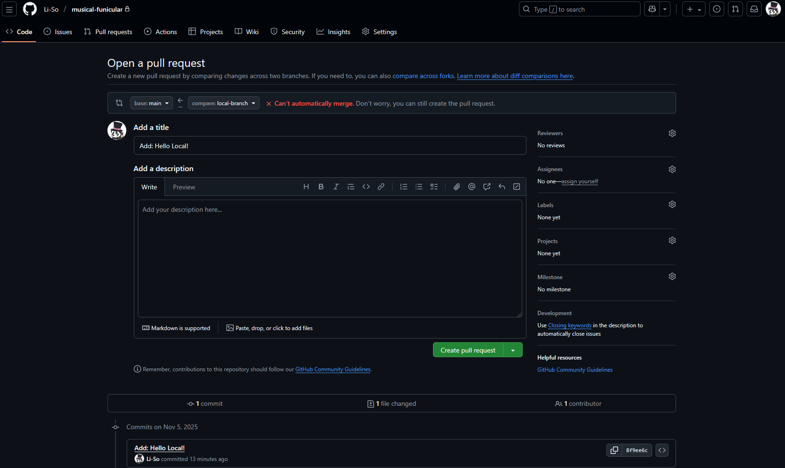

This is where you create requests to merge branches together in Github, which are later reviewed (to ensure the changes are of quality). Further down the page, you can see a summary of the changes when attempting to merge the two branches:


In essence, your git (and Github by extension) realized that there were two different commits both trying to change the first line of the JavaScript file. We now need to solve the issue by either:

- Choosing our local changes
- Choosing our remote changes
- Mixing them together

Click on the green button `Create pull request` on the same page. You should arrive here:

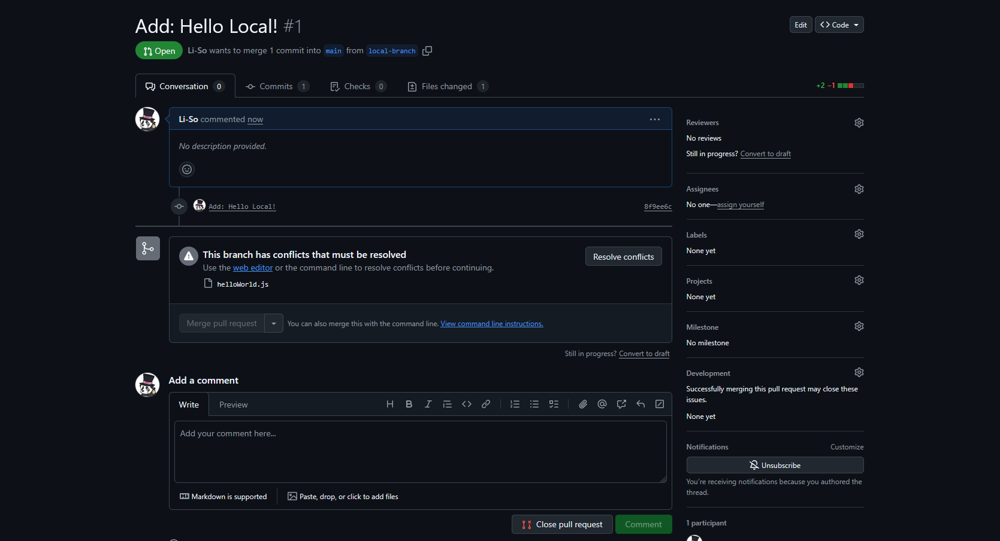

Observe Github prompts you to resolve the conflicts before the branch can be automatically merged. Click on the button `Resolve conflicts` and you'll enter an online editor (this can be done locally, but for this example we're doing it in Github):

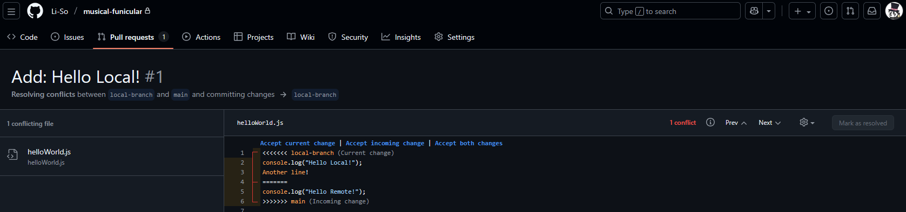

You'll notice these are the changes from both branches, separated by many equal signs and boxed in by several <<<<< and >>>>>>. These are the lines Github needs help solving, as it is rarely every line in a file that causes a merge conflict.

The first part underneath the first line `<<<<< local-branch` are the changes from `local-branch`, while the second are the changes from the `main` branch. If we want to save only the `local-branch` changes, we would change the file accordingly:


If we instead want the changes from main, we would do the following:


Or if we want to merge the changes to keep both, we remove the arrows and equal signs to mark we want the first two lines from `local-branch` and move the first line from `main` to the third line (observe the screenshot below).


Without the equal sign and arrow markers, git now knows you want them on lines 1, 2 and 3.

Once the conflict is resolved, click `Mark as resolved` to the far right. In this case, we'll use the option of keeping all the lines from both branches. Once clicked, you'll see a green checkmark and now you're able to click `Commit merge`:


Once clicked, you will return to the pull request and be able to click `Merge pull request` to merge the two:

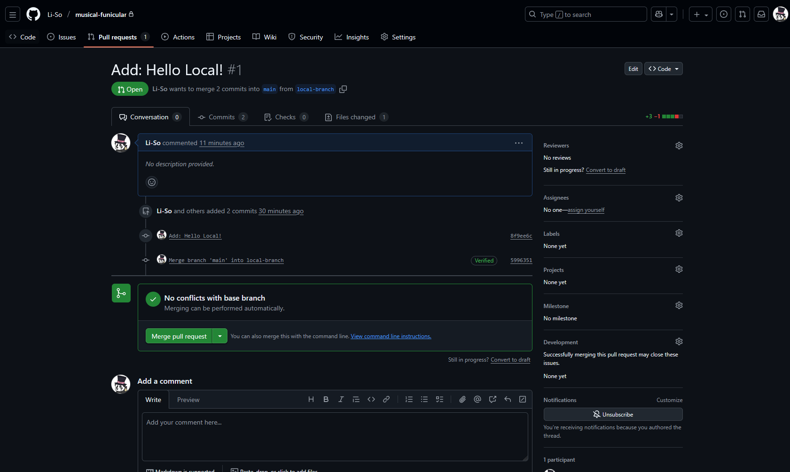

Do so and confirm the merge.


The merge is now complete and you're given the option to delete your branch. You don't have to, though since branches are often related to features or issues it often makes sense to. In the end, this depends on context.

With everything finished, you can now go back to `< > Code` and the fictional project would go on.


